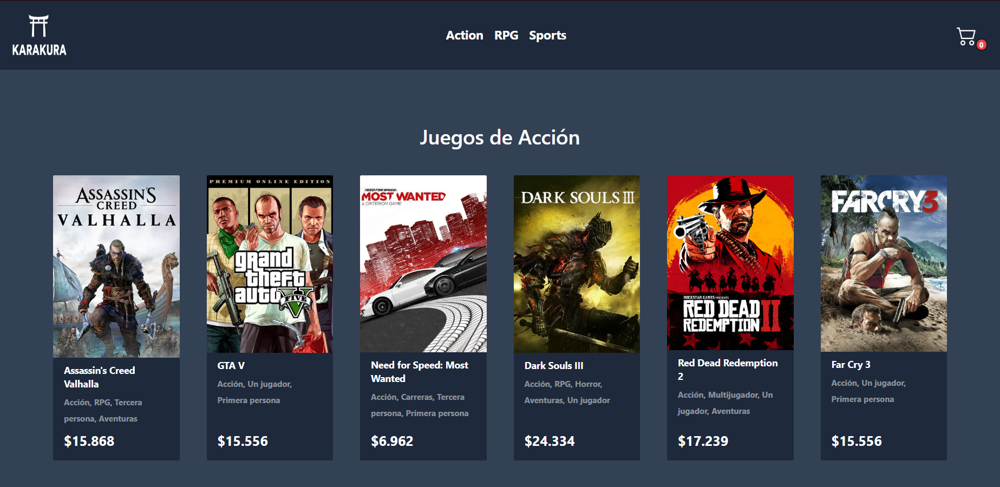

<a name="readme-top"></a>


<!-- PROJECT SHIELDS -->

[![LinkedIn][linkedin-shield]][linkedin-url]


<!-- PROJECT LOGO -->
<br />
<div align="center">
  <a href="https://karakura-store.vercel.app">
    
  </a>

  <h3 align="center">Karakura game store</h3>

  <p align="center">
    E-commerce de los videojuegos más populares
    <br />
    <a href="https://github.com/luferrduc/EntregaFinal-React"><strong>Explore the docs »</strong></a>
    <br />
    <br />
    <a href="https://karakura-store.vercel.app">View Demo</a>
  </p>
</div>


<!-- TABLE OF CONTENTS -->
<details>
  <summary>Tabla de contenidos</summary>
  <ol>
    <li>
      <a href="#acerca-de-mi-proyecto">Acerca del proyecto</a>
      <ul>
        <li><a href="#construida-con">Construida con</a></li>
      </ul>
    </li>
    <li>
      <a href="#getting-started">Getting Started</a>
      <ul>
        <li><a href="#instalación">Instalación</a></li>
      </ul>
    </li>
    <li><a href="#uso">Uso</a></li>
    <li><a href="#roadmap">Roadmap</a></li>
    <li><a href="#contacto">Contacto</a></li>
    <li><a href="#agradecimientos">Agradecimientos</a></li>
  </ol>
</details>


<!-- ABOUT THE PROJECT -->
## Acerca de mi proyecto


Este es un proyecto realizado para la entrega final de mi cursada de React en Coderhouse. Con este proyecto se concluyen varios meses
de desarrollo y aprendizaje. Es un e-commerce de los videojuegos más populares

<p align="right">(<a href="#readme-top">back to top</a>)</p>


### Construida con

En esta sección se muestran algunas de las librerías/frameworks que se utilizaron para construir este proyecto

* [![React][React.js]][React-url]
* [![TailwindCSS][TailwindCSS]][TailwindCSS-url]
* [![React-router-dom][React-router-dom]][React-router-dom-url]
* [![Vercel][Vercel]][Vercel-url]
* [![Firebase][Firebase]][Firebase-url]
* [![React-Hook-Form][React-Hook-Form]][React-Hook-Form-url]

<p align="right">(<a href="#readme-top">back to top</a>)</p>


<!-- GETTING STARTED -->
## Getting Started

Este proyecto es fácil de empezar a usar de manera local. En primer lugar hay que tener instalado nodejs en su versión 18.


### Instalación

_Aquí dejo algunas instrucciones básicas por si quieres descargar y ver el proyecto localmente_

1. Clonar el repositorio
   ```sh
   git clone https://github.com/luferrduc/EntregaFinal-React.git
   ```
2. Instalar los paquetes de NPM
   ```sh
   npm install
   ```
3. Inicializar el proyecto en modo desarrollo
   ```sh
   npm run dev
   ```
4. Abrir el proyecto en el puerto que indica Vite que suele ser el siguiente
   ```sh
   VITE v4.3.9  ready in 1334 ms
   ➜  Local:   http://localhost:5173/
   ➜  Network: use --host to expose
   ➜  press h to show help
   ```
<p align="right">(<a href="#readme-top">back to top</a>)</p>

<!-- ROADMAP -->
## Roadmap

- [x] Primera entrega
    - [x] Crear un proyecto básico de react ocupando vite
    - [x] Crear la estructura de carpetas
    - [x] Instalar los paquetes a utlizar
    - [x] Crear la página principal
      - [x] Agregar un navbar y listado de links
      - [x] Crear un componente que muestre un texto base
    - [x] Utilizar una base de datos local en un archivo js
- [x] Segunda entrega
    - [x] Agregar nuevas páginas
    - [x] Utilizar react-router-dom para manejar varias páginas
    - [x] Crear página que permita agregar items a un carrito de compras
    - [x] Mostrar los items del carrito en una página a parte
- [x] Entrega final
    - [x] Crear formulario de compra
      - [x] Validar campos del formulario
    - [x] Agregar README.md
    - [x] Mostrar id de la compra al usuario
    - [x] Agrear mensajes de alertas


<p align="right">(<a href="#readme-top">back to top</a>)</p>

## Uso

Imagenes de referencia del sitio web
<div style="display: flex; flex-direction: column; justify-content: center; align-content: center; gap: 8px">



<div>


<p align="right">(<a href="#readme-top">back to top</a>)</p>

<!-- CONTACT -->
## Contacto

Luciano Ferrando - [Linkedin](https://www.linkedin.com/in/luciano-andrés-ferrando-donoso/) - luciano.ferrando94@gmail.com

Link del proyecto: [https://github.com/luferrduc/EntregaFinal-React](https://github.com/luferrduc/EntregaFinal-React)

<p align="right">(<a href="#readme-top">back to top</a>)</p>


<!-- ACKNOWLEDGMENTS -->
## Agradecimientos

Otros recursos que fueron utilizados para este proyecto y agradecimientos a quienes me ayudaron en el proceso

* [Profe Manuel Adán de Coder](https://www.linkedin.com/in/manuel-adan/)
* [Tutor Enzo React Coder](https://www.linkedin.com/in/enzo-agú-desarrollador/)
* [Tutora Cecilia React Coder](https://www.linkedin.com/in/alvarez-cecilia-j/)
* [Img Shields](https://shields.io)
* [Font Awesome](https://fontawesome.com)
* [React Icons](https://react-icons.github.io/react-icons/search)
* [Flowbite](https://flowbite.com)
* [React-Toastify](https://fkhadra.github.io/react-toastify/introduction/)

<p align="right">(<a href="#readme-top">back to top</a>)</p>


<!-- MARKDOWN LINKS & IMAGES -->
<!-- https://www.markdownguide.org/basic-syntax/#reference-style-links -->
[contributors-shield]: https://img.shields.io/github/contributors/othneildrew/Best-README-Template.svg?style=for-the-badge
[contributors-url]: https://github.com/othneildrew/Best-README-Template/graphs/contributors
[forks-shield]: https://img.shields.io/github/forks/othneildrew/Best-README-Template.svg?style=for-the-badge
[forks-url]: https://github.com/othneildrew/Best-README-Template/network/members
[stars-shield]: https://img.shields.io/github/stars/othneildrew/Best-README-Template.svg?style=for-the-badge
[stars-url]: https://github.com/othneildrew/Best-README-Template/stargazers
[issues-shield]: https://img.shields.io/github/issues/othneildrew/Best-README-Template.svg?style=for-the-badge
[issues-url]: https://github.com/othneildrew/Best-README-Template/issues
[license-shield]: https://img.shields.io/github/license/othneildrew/Best-README-Template.svg?style=for-the-badge
[license-url]: https://github.com/othneildrew/Best-README-Template/blob/master/LICENSE.txt
[linkedin-shield]: https://img.shields.io/badge/-LinkedIn-black.svg?style=for-the-badge&logo=linkedin&colorB=555
[linkedin-url]: https://linkedin.com/in/luciano-andrés-ferrando-donoso/
[Next.js]: https://img.shields.io/badge/next.js-000000?style=for-the-badge&logo=nextdotjs&logoColor=white
[Next-url]: https://nextjs.org/
[React.js]: https://img.shields.io/badge/React-20232A?style=for-the-badge&logo=react&logoColor=61DAFB
[React-url]: https://reactjs.org/
[Bootstrap.com]: https://img.shields.io/badge/Bootstrap-563D7C?style=for-the-badge&logo=bootstrap&logoColor=white
[Bootstrap-url]: https://getbootstrap.com
[TailwindCSS]: https://img.shields.io/badge/tailwindcss-%2338B2AC.svg?style=for-the-badge&logo=tailwind-css&logoColor=white
[TailwindCSS-url]: https://tailwindcss.com
[React-router-dom]: https://img.shields.io/badge/React_Router-CA4245?style=for-the-badge&logo=react-router&logoColor=white
[React-router-dom-url]: https://reactrouter.com/en/main
[GitHub]: https://img.shields.io/badge/github-%23121011.svg?style=for-the-badge&logo=github&logoColor=white
[Vercel]: https://img.shields.io/badge/vercel-%23000000.svg?style=for-the-badge&logo=vercel&logoColor=white
[Vercel-url]: https://vercel.com
[Firebase]: https://img.shields.io/badge/Firebase-039BE5?style=for-the-badge&logo=Firebase&logoColor=white
[Firebase-url]: https://firebase.google.com/
[React-Hook-Form]: https://img.shields.io/badge/React%20Hook%20Form-%23EC5990.svg?style=for-the-badge&logo=reacthookform&logoColor=white
[React-Hook-Form-url]: https://www.react-hook-form.com